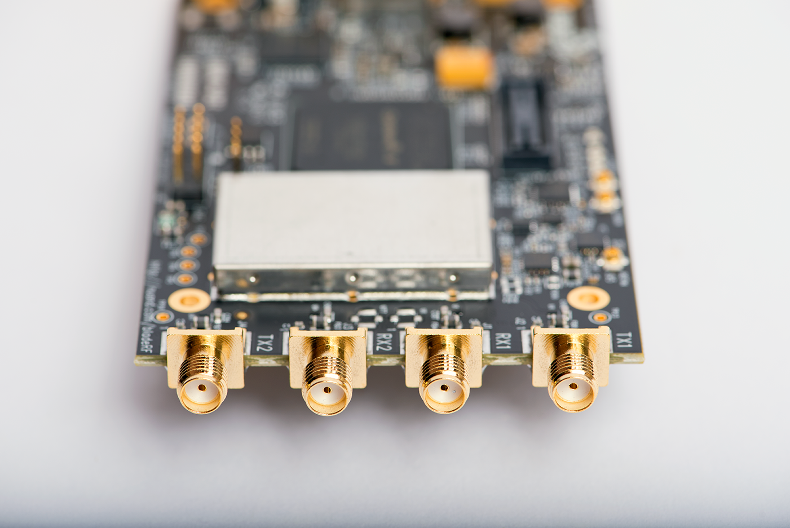

# COM-304: Communication Project. Signal processing & bladeRF

This repository contains the material for the software-defined radio (bladeRF) project of the course COM-304 at EPFL.
- [COM-304: Communication Project. Signal processing & bladeRF](#com-304-communication-project-signal-processing-&-bladerf)
- [Important Dates](#important-dates)
- [Project](#project)
- [Homeworks](#homeworks)
- [Studying Material \& Resources](#studying-material--resources)
- [General Info](#general-info)

# Studying Material: Tutorials & Resources

- [Getting started with BladeRF](https://github.com/samhy99/COM-304-BladeRF/wiki): This guide will help you set up your BladeRF drivers and required software on your computer. It also includes two toturoials for example applications to try out the bladeRFs. 
- [Signal processing](notebooks): This folder contains jupyter notbooks that will help you understand and practice some signal processing topics that you will need for implementing a project on a sofware-defined radio. These topics are such as: sampling, quantization, digital filters, modulation schemes, and more. 

 

# Studying Material: Background Lectures 
We also have videos on relevant background material in wireless signal processing. Go through these videos along with the notebooks to get a basic understanding of any signal processing concepts you have not studied before. The lectures on OFDM and Modulation contain essential information that you will need to complete the homeworks.

- [Sampling](https://drive.google.com/file/d/15-WBpQgg1JW0sK7LD4B715cO8PVLUZH_/view?usp=sharing)
- [Modulation](https://drive.google.com/file/d/1dBcHdgbt3Z8WfjLw8eDqG-Cz6VV1qnX_/view?usp=sharing)
- [Wireless Channel](https://drive.google.com/file/d/1U9uZPo3BGUd1OmABDrBEvJCC7zzfRUcX/view?usp=sharing)
- [Up & Down conversion](https://drive.google.com/file/d/15Fti4fNHtR_kuQRuEFB8cPZiXWYNm3HR/view?usp=sharing)
- [OFDM 1](https://drive.google.com/file/d/1W7Y9LAxnSrb2YvD4-X1YPoWba8HUViTN/view?usp=drive_link)
- [OFDM 2](https://drive.google.com/file/d/14MPjapF46gcwxugNRhuWjeqHu7N6X1qr/view?usp=drive_link)

Additional lectures: 
- [Data Rates, Coding & Rate Adaptation](https://drive.google.com/file/d/1CgQyxXrrWgOk3CKvsGT_XF3f_4q0UCVZ/view?usp=sharing)
- [MIMO](https://drive.google.com/file/d/1xTwc6hQ28-ZHzsM0z_9sjPmJHsXat8hV/view?usp=drive_link)
- [Viterbi Coding](https://drive.google.com/file/d/14Op64bWFMQjAPK-ezXivVWvDSh0fHJuv/view?usp=sharing)

For more in-depth understanding, you can also follow the COM-405 lectures from spring 2023 semester 
- [COM-405](https://mediaspace.epfl.ch/channel/COM-405%2BMobile%2BNetworks%2B2023/30796)

# Project

The general goal of the project is to use a software defined radio (BladeRF) to implement XXX, or another porject of your proposal. You will implement your project using the following platform:
- [bladeRF 2.0 micro xA4](https://www.nuand.com/product/bladerf-xa4/)

# Homeworks
There will be two homeworks that will help and prepare you for the project:

- [HW1: Modulation Schemes](notebooks/HW1_Modulation_Schemes.ipynb): In this lab, you will be given 3 misterious signals based on common modulation schemes that you have studied in earlier notebooks. Your objective will be to positively identify them and then demodulate them and recover the "secret" message they contain. This homework is **graded**.
- [HW2: OFDM](notebooks/HW2_OFDM.ipynb): Introduction OFDM signal modulation. This homework is **graded**. 

# General Info

- **Platforms Storage:** For the bladeRF platform, we give them to you for the duration of the project, so you can take them home. If you wish to store them at EPFL, you can book a locker avaliable for students [here](https://mycamipro.epfl.ch/client/lockerassign).
